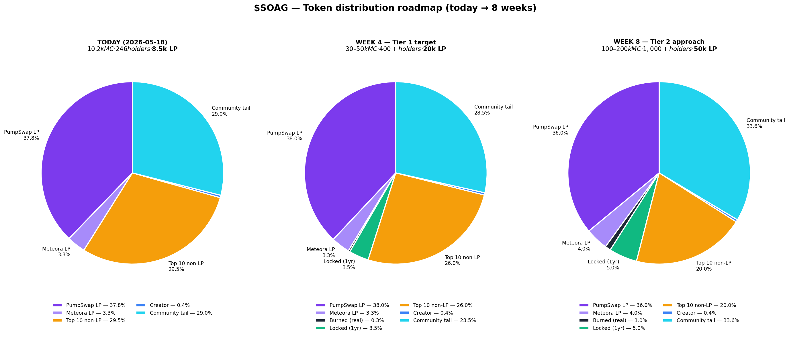

# $SOAG Distribution Roadmap — Today → 8 Weeks

How the supply pie should shift week by week, with the actions and on-chain proofs that move each slice.

**Pulled live:** 2026-05-18 via Helius `getTokenLargestAccounts`
**Today's snapshot:** $10.2k MC · 246 holders · $8.5k LP · top 10 non-LP = 29.5%



---

## What "healthy" actually looks like

A sub-$1M Solana token at "buyer-ready" Tier 1+ status looks roughly like this:

| Slice | % of supply | Why it matters |
|---|---|---|
| **LP (locked or graduated)** | 35–45% | Permanent market-making depth. Pump.fun graduation locks this for you automatically. |
| **Locked (Streamflow/vault, public unlock date)** | 3–10% | Skin-in-the-game signal. Sophisticated buyers click through the Streamflow URL to verify. |
| **Burned (`spl-token burn`, on-chain reduction)** | 0.3–3% | Permanent supply reduction. Visible in `getSupply` — this is the *only* "burn" that counts. |
| **Top 10 non-LP holders** | <30% (Tier 1), <25% (Tier 2), <20% (Tier 3) | Concentration check. You're at 29.5% today — already passes Tier 1. |
| **Creator wallet** | <2% | Anti-rug signal. You're at 0.42% — well clear. |
| **Community tail** (everyone else) | 25–40% | Organic distribution. Bigger = more resilient. You're at 29% today — already healthy. |

**You don't have a distribution problem.** Today's slice ratios are already close to Tier 1 — the gap is liquidity depth and the credibility gap (burn/lock not on-chain yet).

---

## 8-week milestones

Each week has: (1) numerical targets, (2) specific actions, (3) the on-chain proof that lets buyers verify.

### Week 1 — 2026-05-18 to 2026-05-24 — "credibility & LP depth"

**Targets by end of week:**
- ✅ Supply: **996,990,531 SOAG** (3M actually burned)
- ✅ Lock: **35M SOAG locked on Streamflow** with public URL
- ✅ LP: **$15k+** (PumpSwap), Meteora either deepened or closed
- Holders: 270+ (organic +5–10 from Holder Hunt drops)
- MC: $10–15k

**Actions:**
1. **Real burn** — `spl-token burn` 3M SOAG from your creator wallet
   ```
   spl-token burn <YOUR_SOAG_ACCOUNT> 3000000 \
     --program-id TokenzQdBNbLqP5VEhdkAS6EPFLC1PHnBqCXEpPxuEb
   ```
2. **Lock 35M via Streamflow** — open https://streamflow.finance, create lockup, 1-year unlock, no recipient claw-back. Save the public stream URL.
3. **Add 10–15 SOL to PumpSwap LP** — single tx via PumpSwap UI. Cost ~$2k. LP goes from $8k → $15-18k.
4. **Decide on Meteora pool** — either add 5–10 SOL to make it useful or withdraw your position entirely.
5. **Tweet the proofs** — three tweets, one each: burn tx, Streamflow URL, LP-add tx.

**Verification at end of week:**
- `getSupply` returns 996,990,531
- Streamflow URL loads with 35M locked + countdown visible
- DexScreener shows PumpSwap LP $15k+

---

### Week 2 — 2026-05-25 to 2026-05-31 — "holder growth via Holder Hunt"

**Targets by end of week:**
- Holders: **300+** (+30 net)
- LP: stable $15-20k
- Top 10 non-LP: still ~29% (no whale formation)
- MC: $15–25k

**Actions:**
1. **Daily Holder Hunt payouts must reach new wallets.** Modify the payout script to check if the winner already holds SOAG; if yes, prioritize the 2nd/3rd-place winner who doesn't.
2. **Tier-A airdrop:** 1,000 SOAG each to the top 50 Holder Hunt TG members who don't currently hold. Cost: 50,000 SOAG (~$0.50). Tx via sol-agent-wallet.
3. **Pin tokenomics page** on pump.fun description + TG + X bio. Link to SOAG-TOKENOMICS-2026-05-17.md.
4. **Cross-promo DM:** message 2–3 friendly community-token operators (similar size, similar vibe). Trade 100k SOAG airdrops for matching airdrops from them.

**Verification:**
- Helius RPC: `getTokenLargestAccounts` shows more wallets in the 1M+ range
- RugCheck `totalHolders` ≥ 300

---

### Week 3 — 2026-06-01 to 2026-06-07 — "Meteora consolidation + content"

**Targets:**
- Holders: **340+**
- LP: $20k+ (PumpSwap only, Meteora closed) OR $20k PumpSwap + $5k Meteora
- 7-day volume: $5k+

**Actions:**
1. **Resolve Meteora** — by end of this week, either it's a real $5k pool with two-sided routing OR it's closed and consolidated into PumpSwap.
2. **Publish a 60-sec X video** walking through the tokenomics — burn proof, lock proof, LP depth. This is the discoverable artifact that goes in pinned tweet replies forever.
3. **Apply to one DEX aggregator surface** that you're not yet on (Birdeye token verification, Jupiter Strict List, GeckoTerminal listing).

**Verification:**
- DexScreener: one consolidated pool with healthy depth
- Birdeye / Jupiter listing visible

---

### Week 4 — 2026-06-08 to 2026-06-14 — "Tier 1 milestone"

**Targets — this is the Tier 1 cutover:**
- ✅ Holders: **400+**
- ✅ LP: $20k+
- ✅ Top 10 non-LP: ≤26%
- ✅ MC: $30–50k
- ✅ Burn proof live
- ✅ Lock proof live (Streamflow URL)
- ✅ Real public tokenomics page

**Actions:**
1. **Publish 4-week tokenomics report** showing on-chain progression. Use the same chart script (`charts/soag_distribution.py`) but for current state vs Week 0.
2. **Push to crypto Twitter** — one curated thread showing the 4-week delta. "How $SOAG went from $10k → $40k MC with on-chain proofs every week."
3. **Submit to DexScreener trending eligibility check** — at $30k+ MC with $20k+ LP and 400+ holders, you should auto-qualify.

**What unlocks at Tier 1:**
- DexScreener "trending" eligibility — auto-flows organic discovery
- Bot aggregators pick you up (BonkBot, Photon, Maestro all index Tier 1+ tokens)
- KOL outreach becomes credible — you have a track record to point at

---

### Weeks 5-6 — 2026-06-15 to 2026-06-28 — "compound the win"

**Targets:**
- Holders: 600+
- LP: $30k+
- 7-day volume: $10k+

**Actions:**
1. **Burn schedule** — commit to burning 0.5% of supply quarterly from creator wallet. Burn another 1M SOAG this fortnight as the next scheduled burn.
2. **Holder rewards loop** — Holder Hunt + SOAG Vault should now be paying out enough that holders organically grow per week. Track.
3. **Second lock** — once MC hits $50k, lock another 20M SOAG on Streamflow. Sends "we're still here" signal at the new MC level.

---

### Weeks 7-8 — 2026-06-29 to 2026-07-12 — "Tier 2 approach"

**Targets — Tier 2 cutover:**
- ✅ Holders: **1,000+**
- ✅ LP: **$50k+**
- ✅ Top 10 non-LP: ≤20%
- ✅ MC: $100–200k
- ✅ Burn cumulative: ~1% of supply
- ✅ Lock cumulative: ~5% of supply

**Actions:**
1. **Public dashboard at musicailab.com/tokenomics** — auto-updates daily from `getTokenLargestAccounts`. Shows live pie chart + 8-week history.
2. **Community LP program** — formalize the "contribute SOL to LP, get a Bronze/Silver/Gold Bal-claw badge" structure. Pool community SOL into LP with shared fee distribution.
3. **KOL outreach** — at Tier 2 you're worth covering. Pitch 3–5 mid-tier Solana Twitter accounts with the 8-week on-chain story.

**What unlocks at Tier 2:**
- "Watch" coin status on most aggregator front pages
- Legitimate inclusion in "Solana micro-cap" lists
- Listing conversations open up (smaller CEXes, Solana-focused indexes)

---

## The single biggest insight

**You don't need to engineer distribution — you already have it.** Today's top-10 non-LP at 29.5% + flat 2.7–3.3% per holder is the kind of distribution most $100k MC tokens are trying to *achieve*.

The 8-week roadmap is really 3 plays:
1. **Make the burn and lock real on-chain** (Week 1) — converts narrative to proof
2. **Deepen LP from $8k to $50k** (Weeks 1, 5, 7) — the one mechanical gap
3. **Grow holders from 246 to 1,000** (every week) — Holder Hunt + airdrops do most of this for free

Everything else compounds on top.

---

## How to track progress

Run `charts/soag_distribution.py` weekly (Sundays, alongside the weekly recap). Saves the same PNG, lets you diff week-over-week visually.

Add this to the weekly recap as a recurring section:

| Week | Date | Holders | LP | MC | Top 10 non-LP | Burned | Locked |
|---|---|---|---|---|---|---|---|
| W0 | 2026-05-18 | 246 | $8.5k | $10.2k | 29.5% | 0 | 0 |
| W1 | 2026-05-24 | _target 270+_ | _$15k+_ | _$10-15k_ | _29%_ | _3M ✓_ | _35M ✓_ |
| W2 | 2026-05-31 | _300+_ | _$15-20k_ | _$15-25k_ | _28%_ | 3M | 35M |
| W3 | 2026-06-07 | _340+_ | _$20k+_ | _$20-30k_ | _27%_ | 3M | 35M |
| **W4** | **2026-06-14** | **400+** | **$20k+** | **$30-50k** | **≤26%** | 3M | 35M |
| W5-6 | 2026-06-28 | 600+ | $30k+ | $50-100k | ≤24% | 4M | 35M |
| **W8** | **2026-07-12** | **1,000+** | **$50k+** | **$100-200k** | **≤20%** | 10M | 55M |
